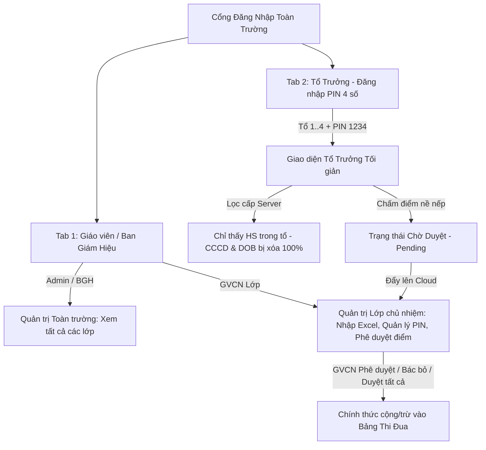

# Báo Cáo Hoàn Thiện: Nâng Cấp Hệ Thống Toàn Trường & Phân Quyền Bảo Mật (RBAC)
*(Phiên bản 5.5 Cloud Edition · Google Sheets Backend · Phân quyền GVCN & Tổ Trưởng)*

---

## 1. Tổng Quan Kiến Trúc Đã Hoàn Thiện

Hệ thống đã được nâng cấp lên chuẩn bảo mật phân quyền đa cấp chuyên sâu (**Role-Based Access Control - RBAC**), đáp ứng trọn vẹn mô hình vận hành của trường học:

---

## 2. Chi Tiết Các Tính Năng Đã Triển Khai

### 2.1. Đăng Nhập Hai Chế Độ (Dual-mode Login)
- **Tab 1: Giáo viên / Ban Giám Hiệu**:
  - Đăng nhập bằng tên tài khoản (`username`) và mật khẩu (`password`).
  - Mẫu: `admin` / `admin123` (xem toàn bộ các lớp), `gv_8a6` / `123456` (khóa cố định vào lớp 8A6).
- **Tab 2: Tổ Trưởng (Mã PIN 4 số)**:
  - Chọn Lớp $\to$ Chọn Tổ (`Tổ 1`, `Tổ 2`, `Tổ 3`, `Tổ 4`) $\to$ Nhập **Mã PIN 4 số** (mặc định ban đầu: `1234`).
  - Tiện lợi, học sinh có thể dùng ngay trên điện thoại hoặc máy tính lớp mà không phải nhớ tên tài khoản dài.

### 2.2. Bảo Mật Dữ Liệu Cá Nhân Cấp Máy Chủ (Tuân Thủ Nghị Định 13/2023/NĐ-CP)
> [!IMPORTANT]
> **Không chỉ ẩn giao diện, hệ thống lọc sạch dữ liệu ngay từ Google Apps Script**:
> - Khi tài khoản có `role === 'group_leader'` gọi hàm `get_class_data`, máy chủ tự động:
>   1. Chỉ trả về danh sách học sinh thuộc đúng tổ được phân công (`assignedGroup`).
>   2. Xóa bỏ hoàn toàn số **CCCD 12 chữ số** (`cccd = ''`) và **Ngày sinh** (`dob = ''`).
>   3. Dù học sinh có mở F12 DevTools hoặc kiểm tra mạng (Network Tab), hoàn toàn **không có bất kỳ dữ liệu định danh nhạy cảm nào bị rò rỉ**.
> - Thanh điều hướng bên trái (Sidebar) tự động ẩn mọi mục quản trị nhạy cảm: chỉ giữ lại `Trang chủ`, `Chấm điểm tổ`, `Thời khóa biểu` và `Đổi quà`.

### 2.3. Quy Trình Phê Duyệt Nề Nếp Hai Cấp (Approval Workflow)
1. **Tổ Trưởng chấm điểm**:
   - Chỉ được chọn học sinh trong tổ của mình.
   - Khi bấm cộng/trừ điểm, bản ghi được lưu với trạng thái **`pending` (Chờ duyệt)** và gửi lên Google Sheets.
   - Tổ Trưởng có bảng theo dõi các bản ghi chờ duyệt của tổ mình và có thể bấm **Rút lại** nếu chấm nhầm.
2. **GVCN phê duyệt**:
   - Trên màn hình **Thi đua tuần** của GVCN, hộp thông báo màu vàng sẽ lập tức xuất hiện khi có bản ghi chờ duyệt.
   - GVCN có thể bấm **Duyệt** từng bản ghi, **Bác bỏ** nếu không chính xác, hoặc bấm **Duyệt tất cả** chỉ với 1 click.
   - Chỉ sau khi GVCN duyệt, điểm mới chính thức cộng/trừ vào tổng điểm tuần của học sinh và bảng xếp hạng tổ.

### 2.4. Bảng Quản Lý Mã PIN Tổ Trưởng (Dành cho GVCN)
- GVCN bấm nút **🔑 PIN Tổ Trưởng** trên thanh công cụ Thi đua tuần.
- Xem danh sách tài khoản hệ thống và mã PIN hiện tại của 4 tổ.
- Cho phép GVCN đổi mã PIN mới cho từng tổ bất cứ lúc nào, hoặc bấm **Đặt tất cả về 1234**.

---

## 3. Các Tệp Đã Được Cập Nhật & Đẩy Lên GitHub

| Tệp tin | Thay đổi chính |
| :--- | :--- |
| [`google_apps_script.js`](file:///d:/WEBAPP%20AI/CHATBOT/CHATBOT-GVCN/google_apps_script.js) | Bổ sung xử lý đăng nhập PIN (`isPinLogin`), lọc bảo mật CCCD server-side, tự động khởi tạo 4 tổ trưởng (`ensureGroupLeaders`), lưu trạng thái `pending`, API duyệt điểm (`handleApproveCompetitionEvents`), và API quản lý PIN (`handleGetGroupPins`, `handleUpdateGroupPins`). |
| [`index.html`](file:///d:/WEBAPP%20AI/CHATBOT/CHATBOT-GVCN/index.html) | Modal đăng nhập 2 tab (GV vs Tổ Trưởng), phân quyền navigation & header, bảng chấm điểm tổ trưởng, bảng phê duyệt GVCN, modal quản lý mã PIN, cập nhật đồng bộ Cloud. |
| [`huong_dan_cai_dat_google_sheets.md`](file:///d:/WEBAPP%20AI/CHATBOT/CHATBOT-GVCN/huong_dan_cai_dat_google_sheets.md) | Bổ sung hướng dẫn cập nhật phiên bản Web App (New version) và cẩm nang vận hành 3 vai trò (Admin, GVCN, Tổ Trưởng). |

---

## 4. Hướng Dẫn Cập Nhật Lên Google Apps Script (Thực Hiện Trong 1 Phút)

Do bạn đã có Web App URL đang hoạt động, bạn chỉ cần cập nhật code mới vào Google Apps Script:

1. Mở file Google Sheets của trường trên trình duyệt $\to$ Vào **Tiện ích mở rộng (Extensions)** $\to$ **Apps Script**.
2. Mở file [`google_apps_script.js`](file:///d:/WEBAPP%20AI/CHATBOT/CHATBOT-GVCN/google_apps_script.js), copy toàn bộ nội dung và dán đè vào `Code.gs`.
3. Bấm **Lưu (Ctrl + S)**.
4. Bấm **Triển khai (Deploy)** $\to$ **Quản lý các lượt triển khai (Manage deployments)**.
5. Bấm biểu tượng ✏️ (Chỉnh sửa) ở góc phải $\to$ Tại mục **Phiên bản (Version)** chọn **Phiên bản mới (New version)** $\to$ Bấm **Triển khai (Deploy)**.
   *(Đường link Web App URL cũ được giữ nguyên 100%, không cần phải copy lại!)*

---

## 5. Trạng Thái Triển Khai GitHub & Vercel

- **Kho lưu trữ GitHub**: [https://github.com/letambp2003-debug/app-gvcn-k8.git](https://github.com/letambp2003-debug/app-gvcn-k8.git)
- **Nhánh chính**: `main`
- **Commit mới nhất**: `0e954da` (*feat: Nang cap phan quyen toan truong (RBAC) voi ma PIN To Truong va quy trinh phe duyet GVCN*)
- **Vercel Deployment**: Tự động nhận diện commit và deploy phiên bản mới nhất.
